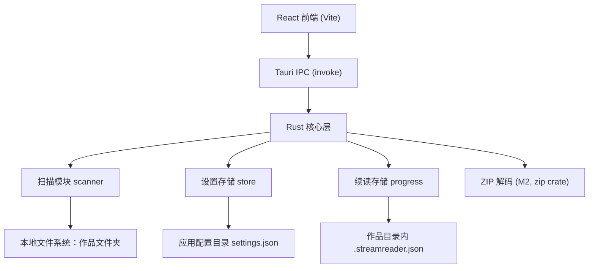

# StreamPicReader 软件规格设计文档

- 版本：v1.0（由 Grill Me 需求澄清产出，需求溯源见 `doc/requirements.md`）
- 状态：设计冻结，进入开发

## 1. 产品概述

StreamPicReader 是一款**条漫（垂直滚动漫画）本地图片阅读器**。用户将漫画作品文件夹逐个添加到软件，进入作品选话后，以"话内图片无缝垂直滚动"的方式阅读，支持续读记忆。

### 1.1 技术栈（R25）

| 层 | 选型 | 职责 |
|---|---|---|
| 桌面容器 | Tauri 2 | 全平台壳（Win/macOS/Linux，移动端后期） |
| 前端 | React + TypeScript + Vite | UI、虚拟滚动、i18n |
| 后端 | Rust | 文件扫描、自然排序、ZIP 解码、持久化 |

### 1.2 平台策略（R1/R2）

Windows 第一优先级先行验证；macOS/Linux 跟进；iOS/Android 基于 Tauri 2 移动端能力后期实施。

## 2. 系统架构



### 2.1 模块划分

| 模块 | 位置 | 职责 |
|---|---|---|
| 作品列表页 | `src/pages/LibraryPage.tsx` | 添加/移除/重选作品、语言切换、路径失效处理（R22） |
| 话列表页 | `src/pages/WorkPage.tsx` | 话自然排序展示、高亮上次阅读话（R14） |
| 阅读页 | `src/pages/ReaderPage.tsx` | 虚拟滚动流、宽度适配、键盘/滚轮交互、上/下一话导航（R8/R9/R16/R18） |
| 扫描模块 | `src-tauri/src/scanner.rs` | 目录扫描、图片过滤（R7/R20）、提取数字自然排序（R5/R6） |
| 设置存储 | `src-tauri/src/store.rs` | 应用配置目录 `settings.json`（R17①） |
| 续读存储 | `src-tauri/src/lib.rs` (progress) | 作品内 `.streamreader.json`（R17②/R14） |

## 3. 页面与功能设计

### 3.1 首页（作品列表）

- 顶部：应用标题 + 中/EN 语言切换按钮（R24）。
- 列表项 = 已添加作品，作品名取文件夹目录名（R13）。
- “添加漫画作品文件夹”按钮 → 系统目录选择器（R13）。
- 路径失效项：标灰 + “路径失效”标记，点击提示，提供“重新选择文件夹”与“移除”操作（R22）。
- 空态：提示文案 + 添加按钮。

### 3.2 作品页（话列表）

- 列出该作品下所有“话”：含图片的子目录，按**提取数字自然排序**（R5）。
- 上次阅读的话高亮显示（R14）。
- 进入作品页时若存在续读记录：弹出确认框“要从上次阅读位置继续吗？”（显示作品名·话名），确认 → 进入该话并恢复滚动位置；取消 → 关闭弹窗，正常浏览话列表（R26）。
- 点击话进入阅读页。

### 3.3 阅读页（核心）

| 项 | 规格 |
|---|---|
| 顶栏 | 左上“主页”按钮（回首页作品列表）、中间作品名·话名、右上“返回”按钮（回话列表） |
| 布局 | 话内图片垂直连续排列，显示宽度 = min(窗口宽, 图片自然宽度)；窗口宽超过图片自然宽后图片不再放大并居中显示；始终保持原始长宽比，不支持缩放（R16） |
| 间隙 | 相邻图片间 **2px** 固定间隙（看得见但不明显），间隙颜色 = 深色背景色（R10/R21/R24） |
| 滚动 | 原生垂直滚动（滚轮/触控板/键盘/移动端单指滑动，R18）；跨话不连续（R8） |
| 加载 | 虚拟滚动/懒加载：仅加载视口上下约 1500px 预加载区内的图片，离开后释放（R11） |
| 损坏图 | 原位显示占位块“图片无法加载 + 文件名”，滚动流不中断（R23） |
| 底部导航 | 固定“上一话 / 下一话”按钮：第一话时上一话位置显示“第一话”且点击无响应；最后一话时下一话位置显示“没有了”且点击无响应（R9） |
| 键盘 | ↑/↓ 滚动，PageUp/PageDown 快翻一屏，Home/End 跳首尾（R18） |
| 续读 | 仅当“从话列表/确认框进入且记录匹配当前话”时恢复滚动位置（R14/R26）；通过上一话/下一话切换时永远从第一张图片开始（R27）；滚动中节流保存（图片序号 + 像素偏移） |

## 4. 数据模型

### 4.1 应用设置（应用配置目录 `settings.json`）

```json
{
  "language": "zh",
  "works": ["D:/comics/某作品", "E:/manga/另一作品"]
}
```

### 4.2 续读记录（作品文件夹内 `.streamreader.json`）

```json
{
  "version": 1,
  "lastChapter": "第12话",
  "imageIndex": 57,
  "offset": 342.5
}
```

- 每作品仅一组记录（R14）；`imageIndex` + `offset` 可精确定位滚动位置且对图片增删有一定容错。

## 5. IPC 接口设计（Tauri command）

| Command | 参数 | 返回 | 说明 |
|---|---|---|---|
| `list_works` | — | `WorkInfo[] {path,name,valid}` | 读取 settings，检测路径有效性 |
| `add_work` | `path` | — | 校验目录后追加到 settings |
| `remove_work` | `path` | — | 从 settings 移除 |
| `list_chapters` | `workPath` | `ChapterInfo[] {name}` | 扫描子目录，自然排序 |
| `list_images` | `workPath, chapter` | `string[]` | 过滤图片扩展名（jpg/jpeg/png/webp），自然排序 |
| `read_image` | `workPath, chapter, name` | 原始字节（`tauri::ipc::Response`） | 以原始字节传输，避免 base64 体积膨胀与编解码开销；压缩档话按 ZIP 条目读取（按路径缓存 `ZipArchive`，mtime 失效）；名称经白名单与防穿越校验；后续可切 asset 协议优化 |
| `get_progress` | `workPath` | `Progress` | 读 `.streamreader.json`，不存在返回空 |
| `save_progress` | `workPath, progress` | — | 写 `.streamreader.json` |
| `get_language` / `set_language` | —/`language` | `"zh"/"en"` | 语言持久化 |

## 6. 关键技术方案

### 6.1 虚拟滚动（R11/R12）

- 为全部图片保留占位 DOM，未加载项使用**估算高度**（容器宽 × 1.4 系数）占位。
- `IntersectionObserver`（rootMargin ≈ 1500px）驱动加载/释放：进入预加载区解码显示，离开释放 `objectURL`。
- 图片加载完成后以 `naturalHeight/naturalWidth × 容器宽` 修正高度，滚动条随之收敛。
- 该方案满足 300 张 × 1~3MB、3~5 秒内可读的性能基线，且内存仅与视口附近图片相关。

### 6.2 自然排序（R5/R6）

从话名/文件名中提取**第一段连续数字**作为主排序键，原始名作为次序键；无数字者排最后。

### 6.3 图片格式（R20）与过滤（R7）

白名单扩展名：`jpg/jpeg/png/webp`（大小写不敏感）；非图片文件一律忽略（含作品内 `.streamreader.json`）。

### 6.4 压缩档（R15，里程碑 M2）

CBZ/ZIP 按 ZIP 内核处理：话列表中 zip/cbz 文件与话目录并列；阅读时用 Rust `zip` crate 按条目名读取，复用现有 `read_image` 接口形态。

## 7. 界面规格

- 主题：仅深色（R21），背景色同时用于图片间隙。
- 语言：简中/英文可切换，首页入口，选择持久化（R19/R24）。
- 文案键（i18n）：addWork、pathInvalid、reselect、remove、prevChapter、nextChapter、firstChapter、noMore、imageLoadFailed、back、emptyLibrary 等。

## 8. 错误处理

| 场景 | 行为 |
|---|---|
| 作品路径失效 | 标灰 + 提示 + 重新选择/移除（R22） |
| 图片解码失败/读取失败 | 原位占位块，滚动不中断（R23） |
| 续读文件缺失/损坏 | 视为无记录，从第一张开始 |
| 作品文件夹不可写 | 续读保存静默失败，不影响阅读 |

## 9. 非功能需求（N1~N3）

- 性能：300 张 × 1~3MB/话，打开后 3~5 秒内可滚动阅读。
- 包体：桌面安装包保持小体积（Tauri 特性）。
- 节奏：Windows 先行；macOS/Linux 次之；移动端最后。

## 10. 里程碑

| 里程碑 | 内容 |
|---|---|
| M1 | Windows 桌面 MVP：散图阅读全链路（书架/话列表/阅读/续读/i18n/深色主题）✅ |
| M2 | CBZ/ZIP 支持（✅ 已实现，含 ZipArchive 缓存）；asset 协议优化图片传输（待做） |
| M3 | macOS / Linux 适配与打包 |
| M4 | iOS / Android（Tauri 2 移动端） |
